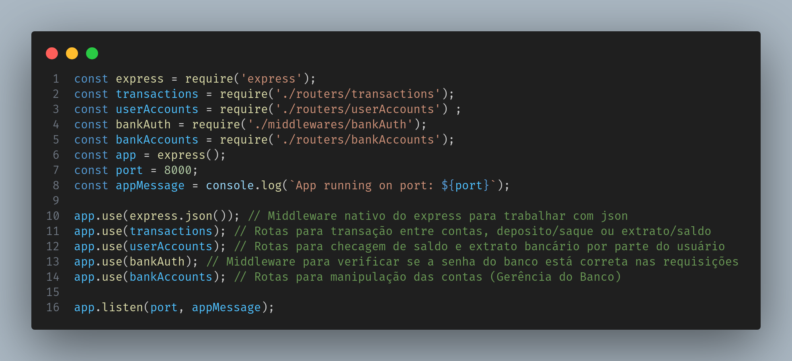

# BANK API

This is a simple API that creates, updates and deletes accounts from a Bank, it also haves money transfer, deposit and withdrawal functionalities.

## Functionalities

- Account creation
- Account updating
- Money transfer
- And more...

## Demo

[Guide on youtube](https://youtu.be/r9LioECpjpg)

## Screenshots

## How to run the app

With node 18.17.1 or newest run the app by writing on the console:

npm install 

node src/index.js

If everything went well you should have printed on your console that the app is running on a port (default: 8000).

## HTTP testing

I've created collections so testing each requisition is going to be easier. (thunder-collection)  